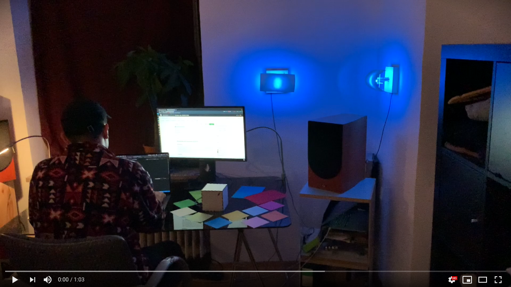

# Sketching with Hardware SS2020

- [Sketching with Hardware SS2020](#sketching-with-hardware-ss2020)
  - [Project Vision](#project-vision)
  - [Description](#description)
    - [Technical Abstract](#technical-abstract)
    - [Features](#features)
  - [Development](#development)
    - [Commands](#commands)
  - [Contributors](#contributors)
    - [Individual contributions](#individual-contributions)

## Project Vision

Combining HCI, IoT and industrial design, this project aims to explore the possibility of a modern, interactive motion control system for harmonious and individualistic room lighting.

Our proposed system consists of two components.
The light installation, consisting of multiple symmetrical lamps each with an integrated adjustable RGB LED light source, as well as a servo motor to adjust and move the position of the lamp panels to change the room illumination intensity. All required electronic components for communication and control are built into the lights base plate, which gets powered by a simple USB cable. The system allows to scale the number of individual lamps up to any desired amount, without any additional configuration changes besides initially configuring the WiFi.
The other core unit of the system is the so-called “magic cube”, which controls all connected lights remotely. It integrates different sensors and a microcomputer to control the LED colour and angle of the lamp panels.
The built-in gyroscope sensor detects the rotational movement on the cube. Depending on the movement direction, e.g. clock or anti-clockwise, the light panels change their aperture angle. The bottom side of the cube contains a colour sensor, which on-demand, scans the colour of the underlying surface. All the registered and captured data is sent directly via WiFi to the light installation.

[](https://www.youtube.com/watch?v=AeCGOGRvR3k)

## Description

### Technical Abstract

Multiple Lights are controlled over a direct WiFi connection (TCP Sockets) by a cube. The cube has a self-constructed colour sensor built into its bottom. Once the cube is put into colour scanning mode, the sensor measures the colour of the surface it is sitting on. The colour of the lamps is then remotely changed to the newly scanned colour by the cube. The colour-sensor gets calibrated by scanning white and black surfaces as a reference and afterwards continuously measures colours by emitting light by three Red, Green and Blue LEDs onto the surface. An LDR sensor sitting next to them senses the reflected light and calculates the colour with the initially scanned white and black differences. On the side of the cube, a physical switch resides which allows switching between the just mentioned colour sensing mode and motion control mode. The cube gives different sound feedback depending on the mode it is in and in colour mode, depending on the stage in the colour scanning process. In motion detection mode, a built-in gyroscope sensor measures the cube's rotation to dim the light intensity of the lamps accordingly by controlling a motor rotation of the panels covering the light sources. The whole environment is built in a way that once a WiFi connection has been configured initially, every part of it can power off/on at any time without failing the whole system. Lamps will wait until a cube comes available, auto-connect to it, moreover the cube will only start measuring interaction if at least one lamp has connected to it. All parts can also be rebooted remotely via a simple (Postman) request which changes a variable on the universities database. Afterwards, the devices restart, boot and connect automatically.

### Features

- Magic cube: compact, physical controller as input
  - minimal, compact cube which houses multiple sensors
  - A DIY colour sensor on the bottom which changes the colour of the lamp to the colour of the surface the cube is sitting on
    gyro sensor detecting the cube’s rotation to control the rotation of the lights’ panels
  - A switch to change between motion and colour control mode
  - Audio feedback depending on the cubes current mode - different beeping noises in colour scan mode & Geiger counter like audio feedback in motion control mode
  - Opens up a socket server & waits for lamps to control
  - Auto-Boot into wait mode
- Light installation: potentially endless amount of symmetrical lamps:
  - Multi-colour RGB LED Ring
  - Adjustable rotation & light intensity reflected onto the wall realized with a controllable servo motor
  - Connects directly to the cube via a socket connection
  - Robust auto-cube detection/connection on boot/disconnect once WiFi has been configured once

## Development

### Commands

Install pipenv:

```bash=
pip install --upgrade pipenv
```

Install dependencies:

```bash=
pipenv install
```

## Contributors

- Andreas Ellwanger
- Andreas Griesbeck
- Aline Neumann
- Maximilian Rauh

### Individual contributions

Due to the small group size of 4, it is impossible for us to properly distinguish what of our project has been done by whom. We all worked on all parts of our application, especially since we mostly did “pair-programming” (with two or often all four of us working together). So all of us were equally involved in all parts of our application. We would be happy to answer questions about our development process, as well as our individual/collective contributions at the examination.
